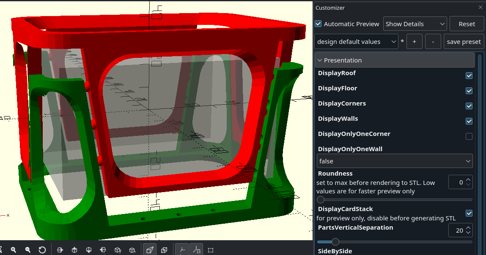
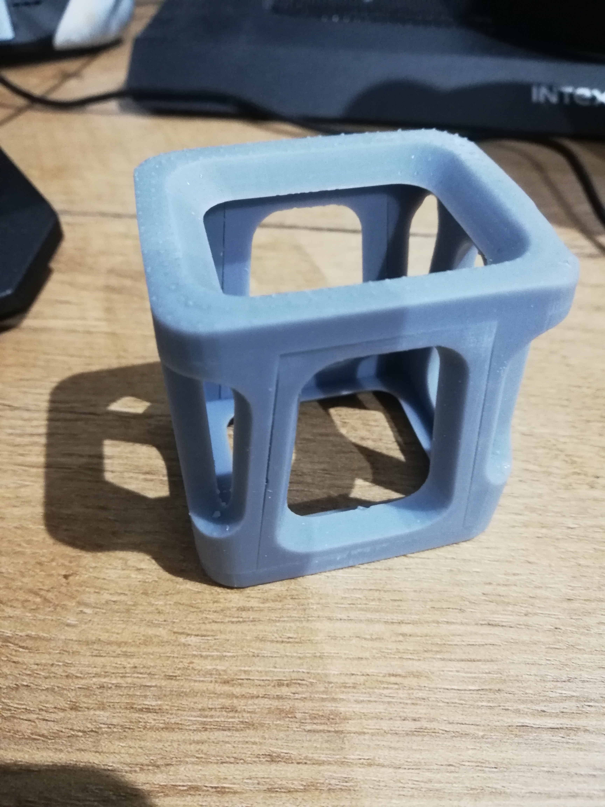
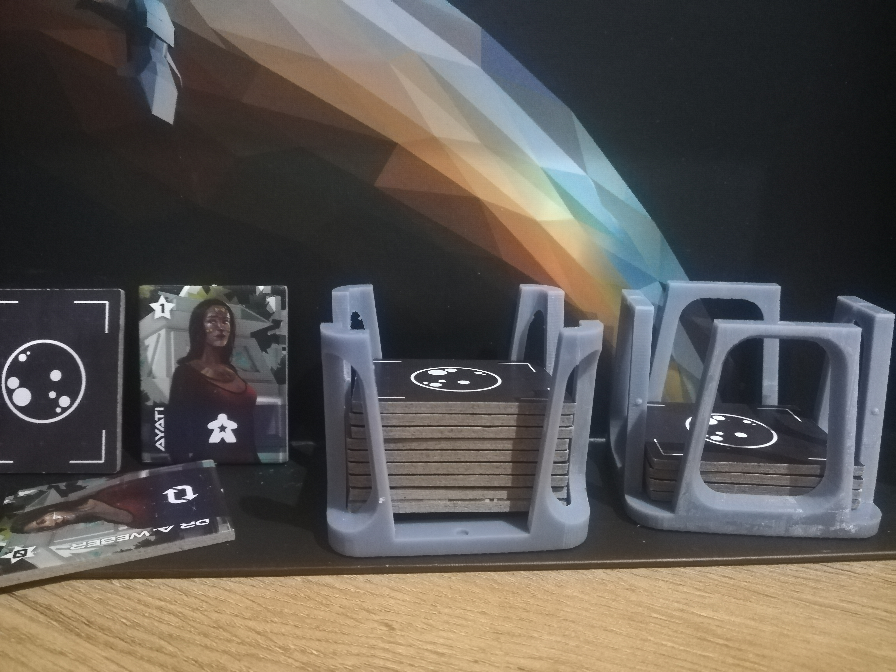
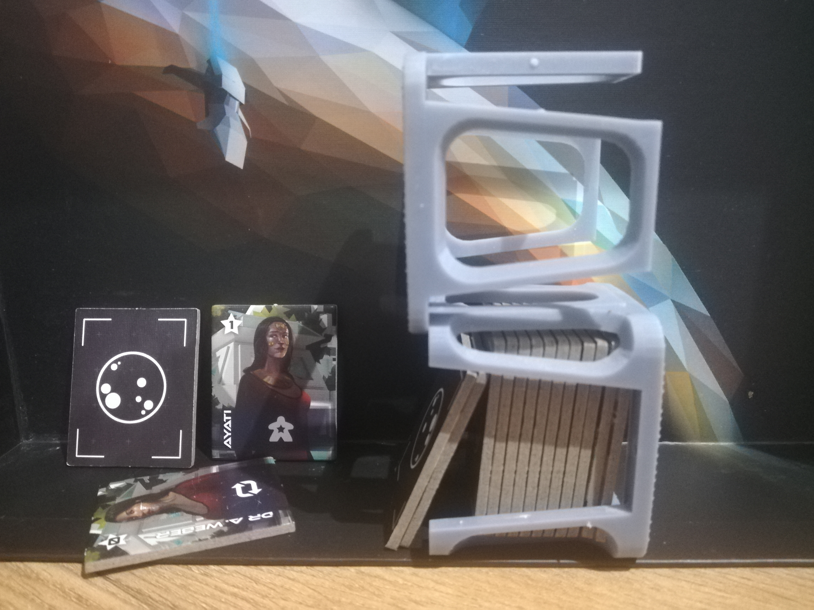

# Configurable card/tile holder

## Features

- 100% OpenSCAD code
- very customizable
- windowed walls to save on materiel
- snuggly fitting sides
- optional clip with impressive strength
- optional magnet holes
- pretty rounded corners

## Dependencies

- [dotSCAD](https://github.com/JustinSDK/dotSCAD) - 

## Examples
 
 Basic structure offers snug fit and weak friction locking even without any clip or magnets.

Very small clip, tiny dot on middle of walls, is enough to keep it locked even when shaken with full load.

Clip is so strong you can do silly things even without magnets!

## Configurator
 
 TODO describe after finished and refactored